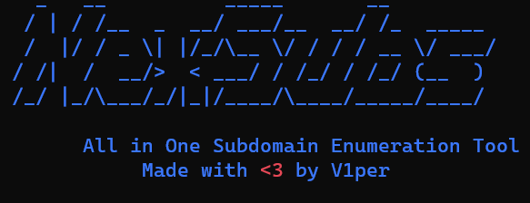

<h1 align="center">
  <b>NexSubs</b>
  <br>
</h1> 
<h3 align="center">
All in One Subdomain Enumeration Tool
</p>
<br/>



-----------------------------
### What is NexSubs ?
 NexSubs is an automation tool for finding the subdomains of the given target or targets. It uses multiple tools and various online search engines and services in parallel to find subdomains effectively and sort and save them in an organised way.

#### Platforms Tested:
 + Debian based Linux

### Installation
```
git clone https://github.com/pushpak-11/NexSubs.git
cd NexSubs 
chmod +x install.sh NexSubs
./install.sh
```

### Usage
```
  
    _   __          _____       __        
   / | / /__  _  __/ ___/__  __/ /_  _____
  /  |/ / _ \| |/_/\__ \/ / / / __ \/ ___/
 / /|  /  __/>  < ___/ / /_/ / /_/ (__  ) 
/_/ |_/\___/_/|_|/____/\__,_/_.___/____/  
                                          
 

        All in One Subdomain Enumeration Tool         
             Made with <3 by V1per            


 Options:
    -d ==> Domain To enumerate
    -o ==> Output file to save the Final Results
    -h ==> Displays this help message and exit
    -v ==> Displays this version and exit
 ```

### Tools Included
+ Subfinder
+ Assetfinder
+ Chaos
+ Shuffledns
+ Findomain
+ Amass
+ Gauplus
+ Waybackurls 
+ Github-Subdomains
+ Gitlab-Subdomains
+ Crobat
+ CTFR
+ Cero
+ Sublist3r
+ Shodomain
+ Censys-Subdomain-Finder
+ Nmap

### Online Search Engines & Services
+ Archive (Wayback Machine)
+ BufferOver
+ Crtsh
+ Riddler
+ CertSpotter
+ JLDC
+ HackerTarget
+ ThreatCrowd
+ Anubis
+ ThreatMiner
+ Omnisint(Crobat)

### API keys
+ Add your API keys in [here](https://github.com/pushpak-11/NexSubs/blob/5071dd4a7b09a8b21361075a4a4b9126bbff58ed/NexSubs.sh#L44)


### Credit
This tool was inspired by [@bing0o](https://github.com/bing0o) [domains.sh](https://github.com/bing0o/bash_scripting/blob/master/domains.sh) script. Thanks to him for the great idea!

